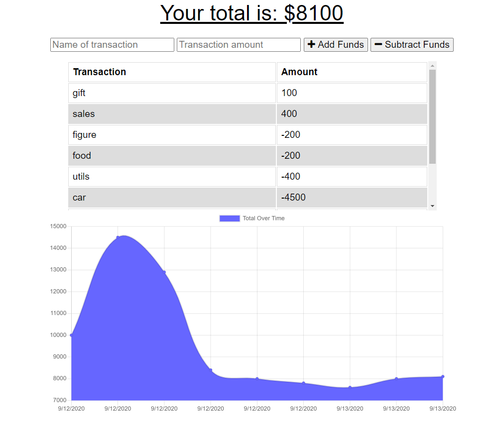

# Progressive Budget Tracker
 

## Description 
This progressive Budget Tracker enables a user to log transactions both online and offline.  This way, a user can keep track of their funds even when the internet is down or during travel.  The app will sync back up once the internet comes back online and the data entered while offline will not be lost and the balance is always accurate.

[Visit the Deployed App Here](https://limitless-island-64454.herokuapp.com/)



---

## Table of Contents
1. [Installation](#Installation)
2. [Usage](#Usage)
3. [License](#license)
4. [Contributing](#Contributing)
5. [Questions](#Questions)
---

## Installation
1. Run ``` npm install``` to install all required dependencies: mongoose, morgan, compression, lite-server, and express. 
2. Run the command ``` npm run start ``` to start the server

## Usage
After intalling all necessary dependencies, the user can simply begin logging their transactions by entering a transaction name and amount, and then either adding or subtracting the funds from the total budget displayed at the top. As the user logs their transactions, the handy chart at the bottom will graph the data and a list will display the transaction history.

---

## License
### ISC License
Copyright (c) 2020 Brianna Bullock

Permission to use, copy, modify, and/or distribute this software for any purpose with or without fee is hereby granted, provided that the above copyright notice and this permission notice appear in all copies.

THE SOFTWARE IS PROVIDED "AS IS" AND THE AUTHOR DISCLAIMS ALL WARRANTIES WITH REGARD TO THIS SOFTWARE INCLUDING ALL IMPLIED WARRANTIES OF MERCHANTABILITY AND FITNESS. IN NO EVENT SHALL THE AUTHOR BE LIABLE FOR ANY SPECIAL, DIRECT, INDIRECT, OR CONSEQUENTIAL DAMAGES OR ANY DAMAGES WHATSOEVER RESULTING FROM LOSS OF USE, DATA OR PROFITS, WHETHER IN AN ACTION OF CONTRACT, NEGLIGENCE OR OTHER TORTIOUS ACTION, ARISING OUT OF OR IN CONNECTION WITH THE USE OR PERFORMANCE OF THIS SOFTWARE. 

---
## Contributing
If a developer would like to contribute, please send Brianna an email using the link below.

---

## Questions

You can visit my [Github Profile](https://www.github.com/kairora) or [this app's Github repo](https://github.com/kairora/progressive-budget-tracker) to learn more about this.
Or, if you have questions regarding this program, please [send me an email](mailto:brianna.bullock16@gmail.com). 